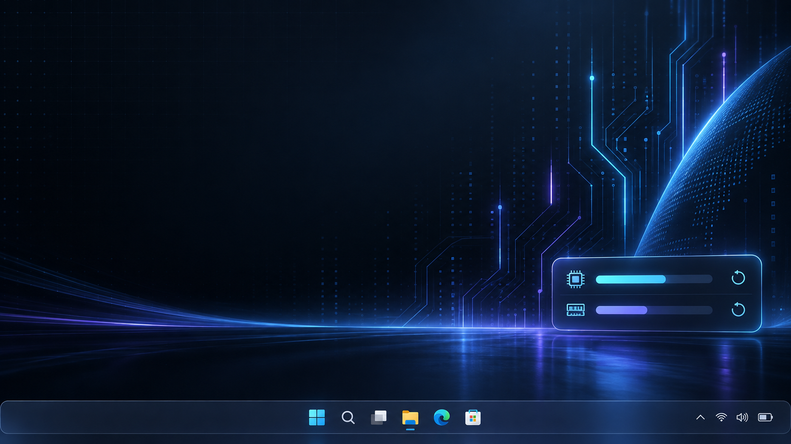
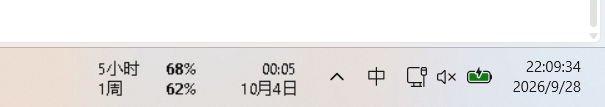

# Codex Usage Taskbar



一个轻量的 Windows 任务栏用量小窗，实时查看 Codex 的 5 小时额度和周额度，并显示下次额度重置时间。



## 功能

- 透明背景、黑色文字，贴合 Windows 任务栏显示
- 显示 5 小时窗口和周窗口的剩余百分比
- 显示 5 小时额度下次重置的本地时间，以及周额度下次重置日期
- 每分钟自动刷新；左键可立即刷新，右键菜单可退出

## 使用要求

- Windows
- 已安装并登录 Codex CLI
- Codex CLI 默认位于 `%APPDATA%\npm\codex.cmd`

## 启动

下载仓库中的 `CodexUsage.exe` 后双击运行。也可以运行 `start.bat`。

如果需要从源码重新构建，在 PowerShell 中运行：

```powershell
powershell.exe -NoProfile -ExecutionPolicy Bypass -File .\build.ps1
```

## 数据与隐私

程序通过本机 `codex app-server --stdio` 请求 `account/rateLimits/read`，读取当前登录账号返回的用量数据。程序包不包含登录令牌，也不会把用量数据写入仓库；本项目没有独立的网络遥测代码。

`taskbar-preview.png` 是项目截图，包含截图时的额度百分比和本地任务栏时钟；`x-cover.png` 是宣传封面。
